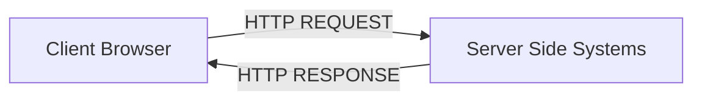
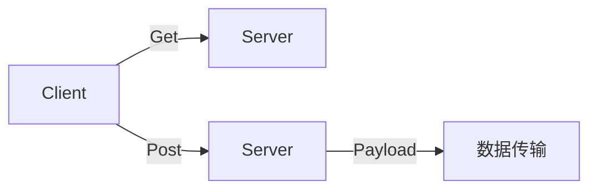

# 学习日记6：Web安全基础知识 

> 本文主要介绍Web安全知识和实用工具，是深入web学习的前提，打牢基础很重要。
> <第四周 1>

## 🔍 目录  

1. HTTP协议基础  

2. HTTP请求方法详解  

3. HTTP请求头解析  

4. 案例分析  


## 1. HTTP协议基础  

<mark>HTTP</mark>（HyperText Transfer Protocol）是一种无状态的应用层协议。  
无状态意味着服务器不会记住你之前做过的决定。  

### 🔍 核心概念  

- **客户端（Client）**：发起请求（Request），通常是浏览器或 Python 脚本。  

- **服务器（Server）**：处理请求并返回响应。  

- **无状态性**：服务器默认不记录两次请求之间的关联，通常通过 Cookie/Session 来维持状态。  



---
## 2. HTTP请求方法详解  

### 📊 GET VS POST  

| 特性 | GET 请求 | POST 请求 |
| :--- | :--- | :--- |
| **主要用途** | 获取资源 | 提交数据 |
| **参数位置** | 参数直接暴露在 URL 中（如 `?id=1`） | 参数位于 请求体（Body）中，URL 不可见 |
| **安全性** | 会被浏览器缓存，历史记录可见（不安全） | 默认不缓存，安全性相对较高 |
| **长度限制** | 受浏览器 URL 长度限制 | 理论上无长度限制，适合传输大量数据 |  

### 📝 传参方式  

- **GET传参**：通常以 `URL/?参数名=参数值` 形式（如：`URL/?a=1`），可以直接在URL中修改参数进行测试。   
通俗解释：**公开**的例子 

- **POST传参**：需在请求体中通过工具（如 Burp Suite）构造，即用工具拦截和修改请求体。      
通俗解释：**私密**的东西 



---
## 5. HTTP请求头解析  

### 🔒 请求头：IP伪造与代理  

- **X-Forwarded-For**：记录客户端的**真实**IP地址（经过代理时）
  - 作用：伪造本地 IP（127.0.0.1）绕过访问限制、日志记录、反向代理    
                       <身份证上的真实身份>   

- **Via**：记录请求经过的代理服务器和网关
  - 作用：识别代理类型、绕过特定的过滤规则、追踪请求经过的中间节点、防止请求循环    
                       <旅行护照上的印章>   

### 🍪 请求头：状态保持（Cookie）  

<mark>Cookie</mark> 用于在客户端存储会话信息（发送服务器之前设置的Cookie信息）。  
它是 CTF Web 题目中** 权限维持 **和 **身份伪造 **的核心。  

```http
Cookie: user = admin; session_id = e10adc3949ba59abbe56e057f20f883e
```  

#### 常见操作  

- **Cookie伪造/修改**：CTF中常需要修改 `user=guest` 为 `user=admin`，或替换 JWT Token 来提升权限。  

- **Cookie注入**：如果后端直接使用 Cookie 中的值进入数据库查询，可能存在 SQL 注入漏洞。  

### 🌐 请求头：内容协商  

- **Accept**：指定客户端能够接受的响应内容类型。常用于内容协商。
  - 示例：`Accept: application/json, text/html`
  - 应用：API 测试中强行要求返回 JSON 格式的数据。  

- **Accept-Language**：声明客户端期望的语言。常用于国际化。
  - 示例：`Accept-Language: zh-CN, en;q=0.9`
  - 应用：有时多语言网站会根据此头包含不同的文件，可能导致文件包含漏洞。  

### 📋 请求头：主体元数据  

| Header | 说明 | 示例与CTF考点 |
| :--- | :--- | :--- |
| **Content-Type** | 指示请求体中的MIME类型。告诉服务器请求体的数据格式，决定后端如何解析数据。常用于POST/PUT等请求。 | 应用：文件上传时修改 content-type 绕过白名单；将 json 改为 xml 触发 XXE。 |
| **Content-Length** | 指示请求体的长度（字节数）。告诉服务器请求体的大小。常用于确定数据传输完成。 | 应用：HTTP 请求走私攻击的核心，利用 CL 和 TE 头的不一致。 |  
  

## 🎯 靶场练习  

**青岑CTF在线靶场**（`ctf.qingcen.net`）  

---
## 📝 写在最后
QAQ

**#CTF #Web安全 #网络安全 #开发者工具 #BurpSuite #漏洞挖掘**
